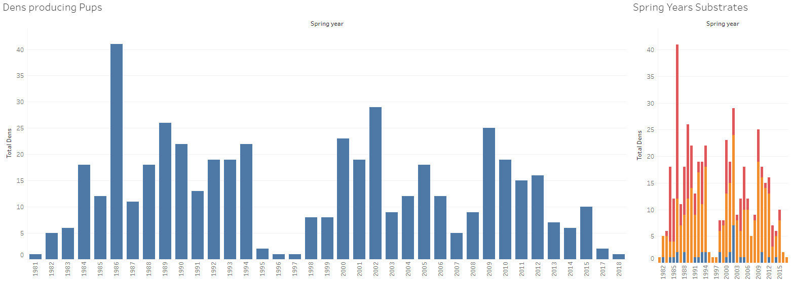

# Team Polarbear

The team worked on a final project for a bootcamp where they showcased the skills learned in the camp into a Machine learning web application. The technologies used in the app are as follows:
* Cloud: Google Colab, AWS S3, AWS RDS PostGres, Heroku, Tableau Public
* Coding Languages: 
* Python - Flask, Pandas, Numpy, Sklearn, Math, Datetime, SqlAlchemy, Pickle, Jupyter Notebook
* DataBase - Sqlite, PostGres 
* Javascript - D3, Vanilla
* HTML - BootStrap
* Tools - PGAdmin, Tableau, VScode, Github

The architecture of the application was to use raw csv data file collected from various sources. Have those file sitting in a S3 bucket. The data was then cleaned and manipluated leveraging Jupyter Notebooks as well as Google Colab. Once cleaned and shaped it was sent to a AWS RDS database where the PGAdmin tool was used to create the needed tables, the data was then used by the Tableau analytics tool to create Maps and Graphs as well as used in the training of the Machine learning Model.

The ground work for the web application was layed using flask, Python, Javascript, HTML

The Map and Charting was done using the popular data analytics tool Tableau where it was set to the Tableau public could and then imported into the application.

The data was pull from the AWS RDS database using SqlAlchemy.

The ML was done with Sklearn,Pandas,Numpy, and Pickle Python libraries, Jupyter Notebook used to graphically analyze the data. The results from this analyzes was exported to the frontend of the application using javascript.

The data table was exported from the routes to the frontend using D3 js

